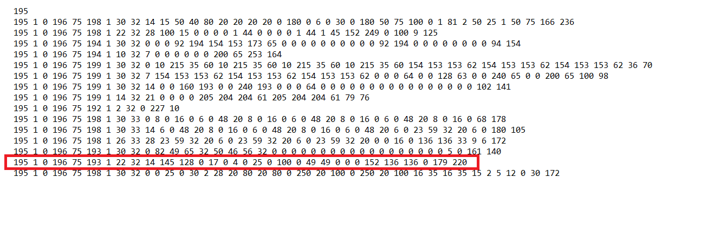

# Flexit-SL4R-master
Control Flexit ventilation with Arduino. Tested on Flexit SL4R but may also work with models S3R, K2R, S3RK, L4X, S4R, S6R, S7R and L7X since they all use the same control board, Flexit CS50.
  
**Wiring**
 

**Data**
 
The CS50 control board sends this bulk of data cyclically:

Meaning of data in line 15 of the 16 lines:

22      **// telegram length**  
32  
14  
145  
128  
0  
17      **// fan level. 17=level1, 34=level2, 51=level3**  
0       **// preheat on/off**  
4  
0  
25      **// preset heat exchanger temperature**  
0       **// heating element active when value >10**  
100     **// heating element inactive when value <100**  
0  
49  
49  
0  
0  
0  
152  
136  
136  
0  
179     **// checksum A**  
220     **// checksum B**  

  

**Issue of buffer overflow** 
 
CS50 sends data at such a rate that the serial RX buffer overflows in seconds. When that happens consistency in data is lost and it becomes useless. It can be solved by increasing SERIAL_RX_BUFFER_SIZE from 64 to 1024 or so. This solution works well with Arduino Mega, but it may be that Arduino Due is better suited for the job. 
 
http://www.hobbytronics.co.uk/arduino-serial-buffer-size
  

**Commands**
 
The command line sent to CS50 contains more than just the one value we want to change. For that reason it is important that data in the command string is updated before each time a command is sent. Otherwise the command will execute more changes than expected. 
  
Example of command:
 
195 4 0 199 81 193 4 8 32 15 0 34 0 4 0 18 52 236
 
8     **// telegram length**  
32  
15  
0  
34    **// fan level. 17=level1, 34=level2, 51=level3**  
0     **// preheat on (128)/off(0)**  
4  
15    **// preset heat exchanger temperature**  
18
52    **// checksum A**  
236   **// checksum B**  

 
The command string is found by eavesdropping with arduino while command is sent from Flexit control panel (CI50). Command string above is just an example! Find the correct values in the specific system and update the command array in .ino file!

